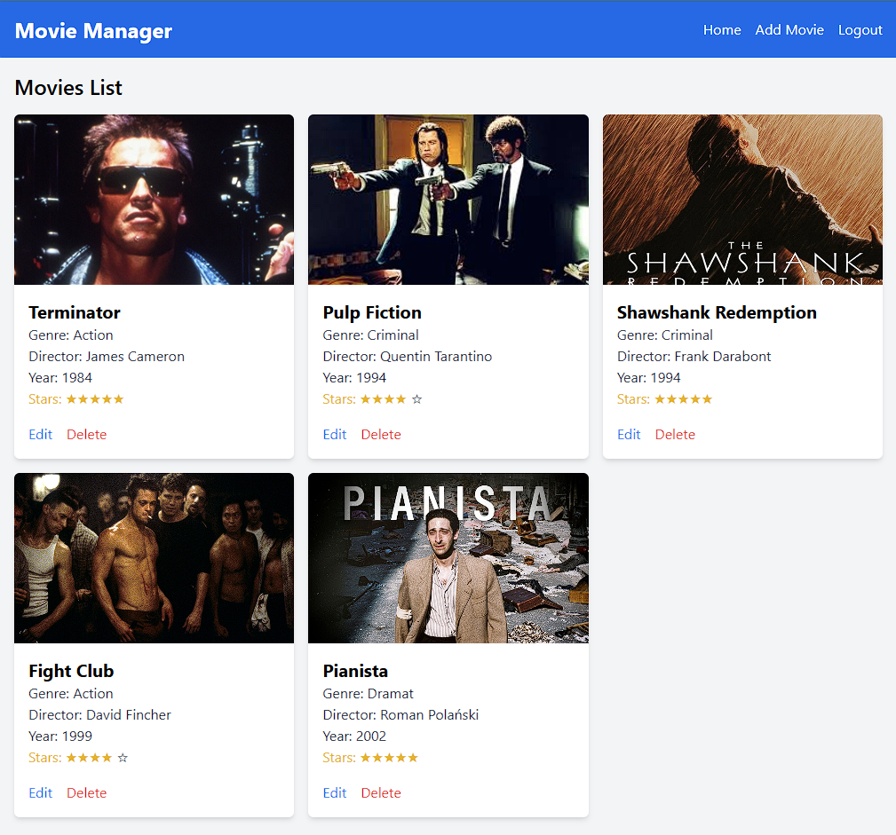
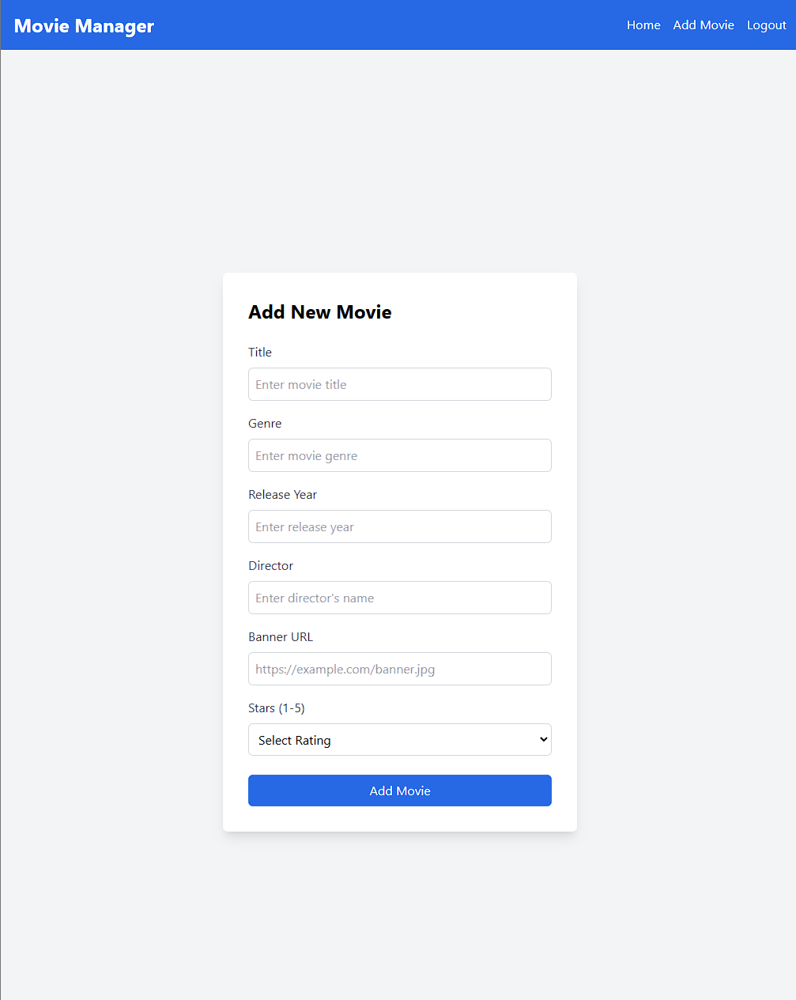
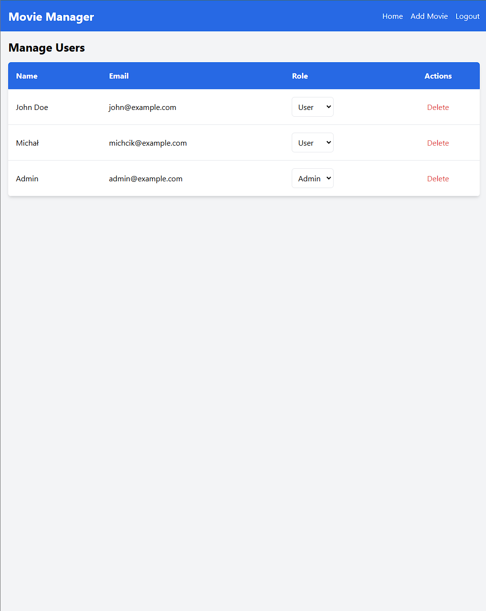
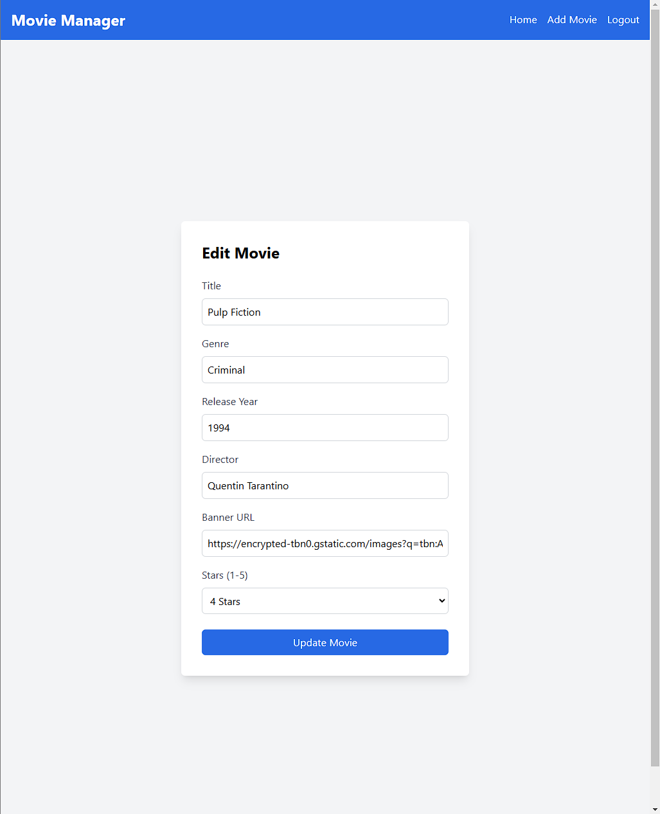
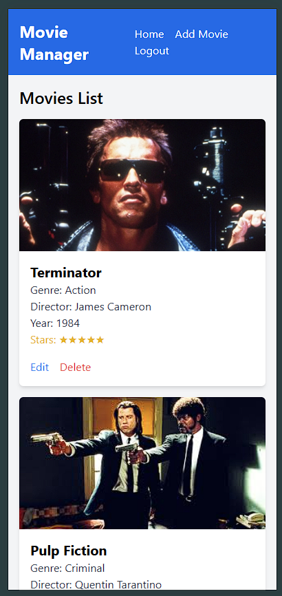

# Movie Manager

## Opis projektu

Movie Manager to aplikacja webowa umożliwiająca zarządzanie listą filmów. Każdy użytkownik może dodawać, edytować, oceniać oraz usuwać swoje filmy. Administrator posiada dodatkowe uprawnienia do zarządzania użytkownikami.

---

## Uruchomienie projektu

### 1. Backend (PHP Laravel)

#### Wymagania:

-   PHP w wersji 8.1 lub wyższej
-   Composer
-   PostgreSQL

#### Instrukcja uruchomienia:

1. Sklonuj repozytorium:

    ```bash
    git clone https://github.com/michalbie/movie-manager
    cd movie-manager
    ```

2. Zainstaluj zależności za pomocą Composera:

    ```bash
    composer install
    ```

3. Skonfiguruj plik `.env`:

    - Sklonuj plik `.env.example`:
        ```bash
        cp .env.example .env
        ```
    - Ustaw dane połączenia do bazy danych (PostgreSQL):
        ```env
        DB_CONNECTION=pgsql
        DB_HOST=127.0.0.1
        DB_PORT=5432
        DB_DATABASE=movie_manager
        DB_USERNAME=postgres
        DB_PASSWORD=haslo
        ```

4. Wygeneruj klucz aplikacji:

    ```bash
    php artisan key:generate
    ```

5. Uruchom migracje i seedery bazy danych:

    ```bash
    php artisan migrate --seed
    ```

6. Uruchom lokalny serwer deweloperski:
    ```bash
    php artisan serve
    ```
    Serwer powinien być dostępny pod adresem: [http://127.0.0.1:8000](http://127.0.0.1:8000)

---

### 2. Frontend (React.js)

#### Wymagania:

-   Node.js w wersji 16.x lub wyższej
-   npm lub yarn

#### Instrukcja uruchomienia:

1. Przejdź do katalogu frontend:

    ```bash
    cd movie-manager-frontend
    ```

2. Zainstaluj zależności:

    ```bash
    npm install
    ```

3. Skonfiguruj plik `.env`:

    - Utwórz plik `.env` w katalogu frontend i ustaw adres backendu:
        ```env
        REACT_APP_API_URL=http://127.0.0.1:8000/api
        ```

4. Uruchom aplikację deweloperską:
    ```bash
    npm start
    ```
    Aplikacja powinna być dostępna pod adresem: [http://localhost:3000](http://localhost:3000)

---

## Funkcjonalności

### Użytkownicy:

-   Rejestracja i logowanie.
-   Dodawanie filmów do osobistej listy.
-   Edycja i usuwanie filmów.

### Administratorzy:

-   Zarządzanie użytkownikami (przypisywanie ról, usuwanie kont).
-   Widok listy użytkowników z możliwością edycji ról.

---

## Screeny aplikacji






Aplikacja w pełni responsywna


---

## Autor

## Michał Biernacki

## Licencja

Projekt posiada licencję MIT.
